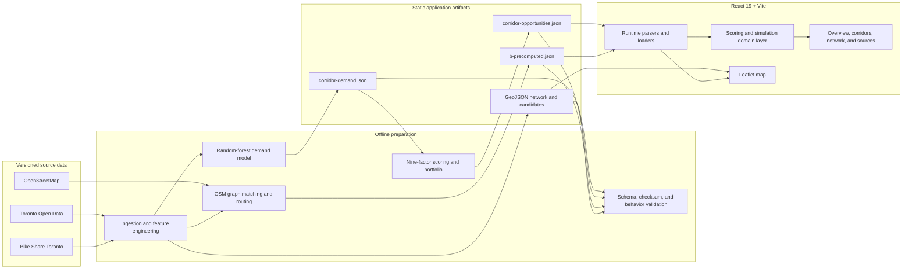

# VeloCity — Toronto Cycling Corridor Explorer

> Explore where a safer cycling connection could provide the most value.

VeloCity is a static React dashboard for comparing 20 corridors from Toronto's
2025–2027 cycling program. It combines trained relative-demand evidence, a
transparent nine-factor priority score, deterministic before/after planning
proxies, and precomputed network routes.

VeloCity is planning evidence, not an official recommendation, engineering
assessment, construction schedule, or causal ridership forecast.

## What the dashboard does

- Ranks candidate corridors with a published, versioned scoring rubric.
- Maps official candidate alignments over the existing cycling network.
- Explains the evidence, model validation, provenance, and limitations behind
  each corridor.
- Compares illustrative before/after accessibility and safety indicators.
- Displays routed Bike Share origin–destination flows when a corridor passes
  the routing pipeline's coverage and quality checks.
- Presents corridor, network, and data-source views in a responsive interface.

## Architecture

VeloCity is a build-time data pipeline feeding a client-only application. Model
training and routing do not run in the browser; validated artifacts are
committed under `public/data/` and fetched by the app at startup.



The browser loads two main scenario artifacts in parallel:

- `corridor-opportunities.json` is the dashboard's canonical joined view. It
  contains trained demand evidence, priority ranks, official geometry, and
  deterministic before/after KPI proxies.
- `b-precomputed.json` contains bounded OSM routing scenarios derived from
  observed Bike Share flows. The map renders these routes only for candidates
  marked `precomputed`; blocked candidates remain visible with their evidence
  and official alignment.

Runtime parsing rejects unsupported artifact versions or malformed top-level
records. Vite's `BASE_URL` is used for all asset requests so the same build works
locally and from the `/VeloCity/` GitHub Pages path.

## Repository layout

| Path | Responsibility |
|---|---|
| `src/App.tsx` | Application shell, navigation, state, and artifact orchestration |
| `src/TorontoMap.tsx` | Leaflet map, cycling network, candidate geometry, and routed flows |
| `src/views/` | Overview-adjacent corridor, network, and source views |
| `src/data/` | Browser-facing artifact types, parsers, loaders, and fixtures |
| `src/lib/` | Scoring, simulation, portfolio, network, and artifact domain logic |
| `scripts/` | Data acquisition, preparation, model export, generation, and validation |
| `data/contracts/` | JSON Schemas for the public artifact contracts |
| `data/processed/` | Reproducible training inputs, split manifest, and evaluation output |
| `data/b-source/` | Pinned, compressed routing inputs and their checksum manifest |
| `public/data/` | Versioned JSON and GeoJSON consumed by the deployed dashboard |
| `.github/workflows/` | GitHub Pages build and deployment workflow |

Large downloads belong in the ignored `data/raw/` directory and must not be
committed.

## Data products and contracts

| Artifact | Role |
|---|---|
| `public/data/corridor-demand.json` | Trained relative demand, uncertainty, raw features, and normalized evidence scores |
| `public/data/candidate-catalogue.geojson` | Official candidate names, IDs, status, and geometry |
| `public/data/corridor-opportunities.json` | Joined dashboard records, priority order, proxy comparisons, and illustrative Year 1–3 portfolio |
| `public/data/b-precomputed.json` | Validated OSM graph metadata, candidate readiness, routed OD partitions, and network scenarios |
| `public/data/flows.json` | Observed June 2024 Bike Share station OD flows and relative weights |
| `public/data/toronto-cycling-network.geojson` | Existing network overlay used by the map |
| `public/data/model-metrics.json` | Model and baseline evaluation summary |
| `public/data/data-manifest.json` | Source provenance, checksums, status, and limitations |

Schemas in `data/contracts/` define the handoff boundaries. Candidate records
join by `corridorId`; generators and validators fail when IDs, geometry,
checksums, schemas, or provenance no longer agree.

## Evidence, scoring, and simulation semantics

The demand model predicts **relative bicycles per observed hour**. It was trained
on 754 June 2024 counter observations using a counter-site spatial split: 10
training sites and 3 held-out sites. Its held-out MAE is `0.675`, compared with
`1.115` for the training-median baseline. This is a relative demand signal, not
a forecast of future riders.

Each corridor also receives nine 0–100 priority inputs:

1. Safety need
2. Connectivity value
3. Equity priority
4. Observed demand
5. Potential demand
6. Transit integration
7. Barrier-crossing value
8. Network coverage gap
9. Destinations served

The weighted score ranks corridors within a tier. Tier gates use the number of
inputs at or above 60: `Top` requires 8–9 strong inputs without a safety,
connectivity, or potential-demand score below 40; `High` requires 6–7 strong
inputs; `Medium` requires 4–5; and `Low` covers 0–3. A core weakness caps an
otherwise `Top` corridor at `High`.

The dashboard's low-stress trips, population connected, destinations reached,
and high-stress segments are deterministic illustrative proxies. They are not
trained outputs or causal effects. OSM route results are a separate analysis:
candidate paths must meet snapping, connectivity, retained-flow, and bounded
route-size thresholds before they are published. The committed bundle currently
marks 1 of 20 candidates as routing-ready; the others include explicit blockers.

See [`data/TRAINING.md`](data/TRAINING.md) for model details and
[`data/README.md`](data/README.md) for source-to-score transformations.

## Local development

Requirements:

- Node.js 22
- npm
- Python 3 only when rebuilding training artifacts

```bash
npm install
npm run dev
```

Vite prints the local development URL. The dashboard requires the committed
files in `public/data/`; no API server or database is needed.

### Verification

Run the full handoff check before submitting changes:

```bash
npm run handoff:check
```

Useful focused commands:

```bash
npm test                    # TypeScript domain and artifact tests
npm run lint                # ESLint and React Hooks rules
npm run data:validate       # Published source/data manifest checks
npm run demand:validate     # Demand contract validation
npm run opportunities:validate
npm run b:validate          # Routing schema, checksums, and canonical regeneration
npm run build               # TypeScript project build and Vite production bundle
npm run preview             # Serve the production bundle locally
```

### Rebuilding artifacts

The fetch commands can download large source files. Run them only when updating
the pinned data snapshot.

```bash
python3 -m venv .venv
source .venv/bin/activate
python3 -m pip install -r requirements-data.txt

npm run data:fetch -- --include-large --include-optional
npm run data:prepare:bike-share
npm run data:prepare:training
npm run model:train
npm run b:prepare
npm run handoff:check
```

`model:train` validates the training boundary, trains and exports demand, then
regenerates the joined opportunity artifact. `b:prepare` rebuilds the routing
bundle from pinned Toronto and OSM inputs. Review regenerated JSON carefully and
announce contract changes before merge.

## Deployment

`.github/workflows/deploy-pages.yml` validates the committed data, builds the
application with Node 22, and deploys `dist/` to GitHub Pages on pushes to
`main`. Configure the repository's Pages source as **GitHub Actions**. Pull
requests should include the verification commands above and screenshots for UI
changes; do not push directly to `main`.

## Known limitations

- Bike Share coverage is geographically and demographically biased, and a
  single June sample is seasonal.
- Counter timing and site coverage are uneven; held-out validation includes only
  three sites.
- Candidate geometry comes from the City program and is not a verified design
  or construction scope.
- Deterministic KPI comparisons and the Year 1–3 sequence are illustrative.
- Routing excludes candidates that fail conservative matching or coverage
  thresholds; it is analysis, not navigation guidance.
- Population and destination metrics are unavailable in the routed OSM
  partitions.
- Engineering feasibility, road width, utilities, cost, consultation, and
  approvals are outside the project scope.
